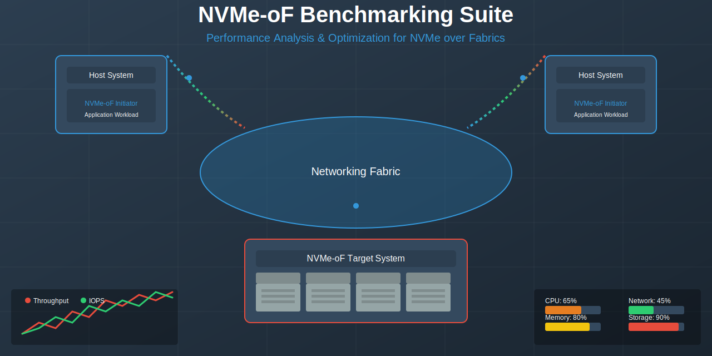

<div align="center">

# NVMe-oF Benchmarking Suite

[](https://github.com/muditbhargava66/nvmeof-benchmark-suite/releases)
[](LICENSE)
[](https://isocpp.org/std/the-standard)
[](https://cmake.org/)
[](https://www.docker.com/)

<p align="center">
  <a href="https://github.com/muditbhargava66/nvmeof-benchmark-suite/stargazers">
    
  </a>
  <a href="https://github.com/muditbhargava66/nvmeof-benchmark-suite/network/members">
    
  </a>
</p>

**A comprehensive toolkit for evaluating and optimizing the performance of NVMe-over-Fabrics (NVMe-oF) storage systems. This suite provides tools for workload generation, performance measurement, bottleneck analysis, and system optimization.**


</div>

## Table of Contents

- [Features](#features)
- [What's New in Version 2.0.0](#whats-new-in-version-200)
- [Requirements](#requirements)
- [Installation](#installation)
  - [Linux Installation](#linux-installation)
  - [macOS Development](#macos-development)
- [Docker Installation](#docker-installation)
- [Usage](#usage)
  - [Basic Benchmarking](#basic-benchmarking)
  - [Advanced Usage](#advanced-usage)
  - [Visualization](#visualization)
- [Scripts](#scripts)
- [Architecture](#architecture)
- [Performance Tuning](#performance-tuning)
- [Contributing](#contributing)
- [Documentation](#documentation)
- [Roadmap](#roadmap)
- [License](#license)
- [Contact](#contact)

## Features

### Core Capabilities

- **📊 Workload Generation**: Create realistic workloads with configurable profiles to simulate different application scenarios
- **📈 Performance Measurement**: Collect comprehensive metrics including throughput, IOPS, and latency
- **🔍 Bottleneck Analysis**: Identify performance bottlenecks in CPU, memory, network, and storage
- **⚙️ Optimization Engine**: Apply automatic optimizations based on detected bottlenecks
- **📷 Visualization**: Display results through intuitive charts and reports

### Technical Highlights

- Thread-safe operations for concurrent workload execution
- Resource monitoring with minimal overhead
- Data collection in multiple formats (CSV, JSON, plaintext)
- Comprehensive test suite covering unit and integration tests
- Docker support for consistent environments
- Cross-platform development support (Linux and macOS)

## What's New in Version 2.0.0

Version 2.0.0 represents a major upgrade with significant improvements:

- **Enhanced Robustness**: Complete code refactoring with modern C++17 features, RAII principles, and comprehensive error handling
- **Testing Framework**: Extensive unit and integration tests with Google Test framework
- **Improved Build System**: Enhanced CMake configuration with better organization and dependency management
- **Thread Safety**: Proper synchronization mechanisms for concurrent operations
- **Enhanced Documentation**: Comprehensive code documentation using Doxygen-style comments
- **Docker Support**: Containerized environments for development and testing
- **macOS Support**: Mock SPDK implementation for development on macOS

For full details, see the [CHANGELOG](CHANGELOG.md).

## Requirements

### Runtime Requirements

- Linux operating system (Ubuntu 20.04 LTS or newer recommended)
- C++17 compatible compiler (GCC 9+ or Clang 10+)
- NVMe-oF target and initiator setup
- SPDK libraries

### Development Requirements

- CMake 3.14 or newer
- Git
- Google Test framework (automatically fetched during build)
- Docker (optional, for containerized development)

## Installation

### Linux Installation

1. Clone the repository:
   ```bash
   git clone https://github.com/muditbhargava66/nvmeof-benchmark-suite.git
   cd nvmeof-benchmark-suite
   ```

2. Install SPDK and dependencies:
   ```bash
   ./scripts/install_spdk.sh
   ```

3. Build the project:
   ```bash
   mkdir -p build && cd build
   cmake ..
   make -j$(nproc)
   ```

4. Install (optional):
   ```bash
   sudo make install
   ```

### macOS Development

For macOS, a mock SPDK implementation is provided to facilitate development:

1. Clone the repository:
   ```bash
   git clone https://github.com/muditbhargava66/nvmeof-benchmark-suite.git
   cd nvmeof-benchmark-suite
   ```

2. Setup the mock SPDK implementation:
   ```bash
   ./scripts/install_spdk.sh
   ```

3. Build the project:
   ```bash
   mkdir -p build && cd build
   cmake ..
   make -j$(sysctl -n hw.ncpu)
   ```

For more details on macOS development, see [macOS Development Guide](docs/macos_development.md).

### Docker Installation

For a consistent development and testing environment:

1. Clone the repository:
   ```bash
   git clone https://github.com/muditbhargava66/nvmeof-benchmark-suite.git
   cd nvmeof-benchmark-suite
   ```

2. Build and run the Docker container:
   ```bash
   # Using the convenience script
   ./scripts/docker_run.sh build     # Build development image
   ./scripts/docker_run.sh run      # Run development container
   
   # Or using docker-compose directly
   cd docker
   docker-compose build nvmeof-development
   docker-compose up -d nvmeof-development
   ```

3. Connect to the container:
   ```bash
   # Using convenience script
   ./scripts/docker_run.sh bash
   
   # Or directly with docker
   docker-compose exec nvmeof-development bash
   ```

4. Inside the container, build the project:
   ```bash
   cd /app/build
   cmake ..
   make -j$(nproc)
   ```

See [Docker README](docker/README.md) for more details.

## Usage

### Basic Benchmarking

1. Configure workload profiles in `data/workload_profiles/`:

   Example workload profile (`workload_profile_1.json`):
   ```json
   {
     "name": "Sequential Read",
     "description": "100% sequential read workload",
     "total_size": 1073741824,
     "block_size": 4096,
     "num_blocks": 262144,
     "read_percentage": 100,
     "write_percentage": 0,
     "random_percentage": 0
   }
   ```

2. Run the benchmark:
   ```bash
   ./build/bin/nvmeof_benchmarking --workload-profile data/workload_profiles/workload_profile_1.json --output-dir data/benchmark_results
   ```

3. View the results:
   ```bash
   ./build/bin/nvmeof_visualizer --input-file data/benchmark_results/benchmark_20250317_120000.csv
   ```

### Advanced Usage

#### Resource Monitoring and Bottleneck Detection

Enable resource monitoring and bottleneck detection during benchmarking:

```bash
./build/bin/nvmeof_benchmarking --workload-profile data/workload_profiles/workload_profile_1.json --output-dir data/benchmark_results --monitor --interval 100
```

#### Automatic Optimization

Enable automatic optimization based on detected bottlenecks:

```bash
./build/bin/nvmeof_benchmarking --workload-profile data/workload_profiles/workload_profile_1.json --output-dir data/benchmark_results --optimize --config-file data/optimization_configs/optimization_config_1.json
```

#### Custom Analysis

Analyze results from a previous benchmark:

```bash
./build/bin/nvmeof_analysis --results-file data/benchmark_results/benchmark_20250317_120000.csv --output-dir data/analysis_reports
```

### Visualization

The suite provides visualization tools for benchmark results:

```bash
./build/bin/nvmeof_visualizer --input-file data/benchmark_results/benchmark_20250317_120000.csv
```

This will display interactive charts and graphs showing:
- Throughput over time
- IOPS distribution
- Latency histograms
- Resource utilization
- Detected bottlenecks

## Scripts

The project includes various scripts to help with development, building, and testing:

### Setup and Build

- **setup.sh**: Sets up the development environment, installs dependencies, and builds the project
  ```bash
  ./scripts/setup.sh
  ```

- **build.sh**: Builds the project
  ```bash
  ./scripts/build.sh [--debug|--release] [--no-tests] [--clean]
  ```

- **install_spdk.sh**: Installs SPDK or sets up SPDK mock on macOS
  ```bash
  ./scripts/install_spdk.sh
  ```

### Running and Analysis

- **run_benchmarks.sh**: Runs benchmarks with specified workload profiles
  ```bash
  ./scripts/run_benchmarks.sh [-p PROFILE] [-m] [-o] [-v]
  ```

- **analyze_results.sh**: Analyzes benchmark results
  ```bash
  ./scripts/analyze_results.sh [-f FILE] [-v]
  ```

- **visualize_results.sh**: Visualizes benchmark results
  ```bash
  ./scripts/visualize_results.sh [-f FILE]
  ```

### Testing and Cleanup

- **run_tests.sh**: Runs unit and integration tests
  ```bash
  ./scripts/run_tests.sh [--unit-only|--integration-only] [-v]
  ```

- **cleanup.sh**: Cleans up build artifacts and generated files
  ```bash
  ./scripts/cleanup.sh [--no-build] [--results] [--all]
  ```

### Docker

- **docker_run.sh**: Manages Docker containers for development and benchmarking
  ```bash
  ./scripts/docker_run.sh [build|run|exec|stop|bash|benchmark] [--env dev|prod]
  ```

For more information about any script, run it with the `--help` option.

## Code directory Structure

```
nvmeof-benchmark-suite/
│
├── docker/
│   ├── Dockerfile
│   ├── Dockerfile.dev
│   └── docker-compose.yml
│
├── src/
│   ├── benchmarking/
│   │   ├── workload_generator.cpp
│   │   ├── data_collector.cpp
│   │   └── result_visualizer.cpp
│   │
│   ├── bottleneck_analysis/
│   │   ├── system_profiler.cpp
│   │   ├── resource_monitor.cpp
│   │   └── bottleneck_detector.cpp
│   │
│   ├── optimization_engine/
│   │   ├── config_knowledge_base.cpp
│   │   ├── optimizer.cpp
│   │   └── config_applicator.cpp
│   │
│   ├── utils/
│   │   ├── nvmeof_utils.cpp
│   │   └── hardware_detection.cpp
│   │
│   ├── main.cpp
│   ├── analysis.cpp
│   └── visualizer.cpp
│
├── include/
│   ├── benchmarking/
│   │   ├── workload_generator.h
│   │   ├── data_collector.h
│   │   └── result_visualizer.h
│   │
│   ├── bottleneck_analysis/
│   │   ├── system_profiler.h
│   │   ├── resource_monitor.h
│   │   └── bottleneck_detector.h
│   │
│   ├── optimization_engine/
│   │   ├── config_knowledge_base.h
│   │   ├── optimizer.h
│   │   └── config_applicator.h
│   │
│   └── utils/
│       ├── nvmeof_utils.h
│       └── hardware_detection.h
│
├── tests/
│   ├── unit_tests/
│   │   ├── benchmarking/
│   │   │   ├── workload_generator_test.cpp
│   │   │   ├── data_collector_test.cpp
│   │   │   └── result_visualizer_test.cpp
│   │   │
│   │   ├── bottleneck_analysis/
│   │   │   ├── system_profiler_test.cpp
│   │   │   ├── resource_monitor_test.cpp
│   │   │   └── bottleneck_detector_test.cpp
│   │   │
│   │   ├── optimization_engine/
│   │   │   ├── config_knowledge_base_test.cpp
│   │   │   ├── optimizer_test.cpp
│   │   │   └── config_applicator_test.cpp
│   │   │
│   │   ├── utils/
│   │   │   ├── nvmeof_utils_test.cpp
│   │   │   └── hardware_detection_test.cpp
│   │   │
│   │   ├── main_test.cpp
│   │   └── CMakeLists.txt
│   │
│   ├── integration_tests/
│   │   ├── end_to_end_test.cpp
│   │   ├── workload_and_bottleneck_test.cpp
│   │   ├── bottleneck_and_optimization_test.cpp
│   │   ├── performance_test.cpp
│   │   ├── main_test.cpp
│   │   └── CMakeLists.txt
│   │
│   └── CMakeLists.txt
│
├── docs/
│   ├── user_guide.md
│   ├── developer_guide.md
│   ├── api_reference.md
│   ├── code_style_guide.md
│   ├── CONTRIBUTING.md
│   └── IMPROVEMENTS.md
│
├── scripts/
│   ├── setup.sh
│   ├── build.sh
│   ├── run_benchmarks.sh
│   ├── run_tests.sh
│   ├── analyze_results.sh
│   ├── visualize_results.sh
│   ├── cleanup.sh
│   ├── docker_run.sh
│   └── install_spdk.sh
│
├── data/
│   ├── workload_profiles/
│   │   ├── workload_profile_1.json
│   │   ├── workload_profile_2.json
│   │   └── workload_profile_3.json
│   │
│   ├── benchmark_results/
│   │   └── .gitkeep
│   │
│   └── optimization_configs/
│       ├── optimization_config_1.json
│       ├── optimization_config_2.json
│       └── optimization_config_3.json
│
├── cmake/
│   └── nvmeof_benchmarking_suite-config.cmake.in
│
├── third_party/
│   └── .gitkeep
│
├── .gitignore
├── CMakeLists.txt
├── LICENSE
└── README.md
```

## Architecture

The NVMe-oF Benchmarking Suite follows a modular architecture:

```
┌─────────────────┐     ┌─────────────────┐     ┌─────────────────┐
│                 │     │                 │     │                 │
│    Workload     │────▶│   Benchmarking  │────▶│   Bottleneck    │
│    Generator    │     │     Engine      │     │    Analyzer     │
│                 │     │                 │     │                 │
└─────────────────┘     └─────────────────┘     └────────┬────────┘
                                                         │
                                                         ▼
                        ┌─────────────────┐     ┌─────────────────┐
                        │                 │     │                 │
                        │  Visualization  │◀────│  Optimization   │
                        │  & Reporting    │     │     Engine      │
                        │                 │     │                 │
                        └─────────────────┘     └─────────────────┘
```

### Key Components

- **Workload Generator**: Creates realistic I/O patterns based on configurable profiles
- **Benchmarking Engine**: Executes benchmarks and collects performance metrics
- **Bottleneck Analyzer**: Identifies performance bottlenecks through system resource monitoring
- **Optimization Engine**: Provides recommendations and automatic optimizations
- **Visualization & Reporting**: Presents results in user-friendly formats

## Performance Tuning

The suite includes several optimization profiles for different scenarios:

1. **Low Latency Profile**: Optimizes for minimal latency
   - Low queue depths
   - Direct I/O
   - Polling mode
   - Single thread

2. **High Throughput Profile**: Optimizes for maximum throughput
   - Deep queue depths
   - Large I/O sizes
   - Multiple threads
   - Huge pages enabled

3. **Balanced Profile**: General-purpose optimizations
   - Moderate queue depths
   - Medium I/O sizes
   - Multiple threads with CPU affinity

## Contributing

Contributions are welcome! Please read our [Contributing Guide](docs/CONTRIBUTING.md) and [Code Style Guide](docs/code_style_guide.md) before submitting pull requests.

### Development Workflow

1. Fork the repository
2. Create a feature branch
3. Add tests for new functionality
4. Ensure all tests pass
5. Submit a pull request

### Running Tests

```bash
cd build
make test
```

For more detailed test output:

```bash
make run_all_tests
```

## Documentation

- [User Guide](docs/user_guide.md): Detailed usage instructions
- [Developer Guide](docs/developer_guide.md): Development information
- [API Reference](docs/api_reference.md): API documentation
- [macOS Development Guide](docs/macos_development.md): macOS-specific instructions

## Roadmap

Future development plans include:

- **Version 2.1.0** (Q3 2025)
  - Support for additional NVMe-oF transports (TCP, RoCE)
  - Integration with popular benchmark tools (FIO, IOzone)
  - Machine learning-based bottleneck prediction

- **Version 2.2.0** (Q1 2026)
  - Distributed benchmarking across multiple hosts
  - Web-based visualization dashboard
  - Advanced metric collection (power consumption, temperature)

- **Version 3.0.0** (Q4 2026)
  - Support for NVMe 2.0 protocol features
  - Automated test suite generation
  - Cloud deployment options

## License

This project is licensed under the MIT License - see the [LICENSE](LICENSE) file for details.

## Contact

- **Project Maintainer**: [muditbhargava66](https://github.com/muditbhargava66)
- **Issue Tracker**: [GitHub Issues](https://github.com/muditbhargava66/nvmeof-benchmark-suite/issues)

---